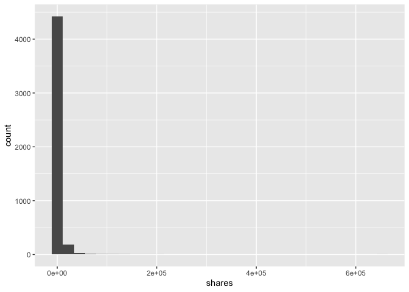

ST558\_PROJECT2
================
Qiaozhi Bao
2020/10/6

# Introduction

## Describe the data

The [Online News Popularity data
set](%22https://archive.ics.uci.edu/ml/datasets/Online+News+Popularity%22)
was published two years ago to summarize a heterogeneous set of features
about articles published by Mashable in a period of two years. There are
61 variables in total from the data set above: 58 predictive attributes,
2 non-predictive and 1 goal field.More details and summarization will be
discussed later in this project.

## The purpose of Analysis

The purpose of this analysis is to create two models(ensemble and not
ensemble) to generate the best predict of the response
attribute–shares.Our analysis will help to determine what kind of
content would be most popular.

## Methods

For this project,I first split the data into training set and test
set,then I examine the data with summary statistics and correlation
plots to see the relationships between predictive attributes and the
relationship between predictive attributes and response variables,then
some meaningless variables were moved. I then utilized the caret package
to create two models.Tree-based model chosen using leave one out cross
validation.Boosted tree model chosen using cross-validation.

# Data Study

## Description of the Used Data

As our study intention is to predict the popularity of an article, so we
choose the shares as the response variable.After plotting the
correlations between variables, we removed some high related predictive
variables. The two models were fitted by remaining variables in the
training set.

``` r
# Load all libraries
library(tidyverse)
library(ggplot2)
library(randomForest)
library(caret)
library(tree)
library(gbm)
library(corrplot)
library(e1071)
set.seed(1)
```

``` r
# Read in data and removing the first two columns as they are not predictive variables.
news_pop <- read_csv('./OnlineNewsPopularity.csv') %>% select(-`url`,-`timedelta`)
```

    ## Parsed with column specification:
    ## cols(
    ##   .default = col_double(),
    ##   url = col_character()
    ## )

    ## See spec(...) for full column specifications.

``` r
params$weekday
```

    ## [1] "weekday_is_monday"

``` r
# First to see Monday data
data <- news_pop%>% select(!starts_with('weekday_is'),params$weekday)
# Check if we have missing values, answer is 'No'
sum(is.na(data))
```

    ## [1] 0

``` r
data <-data %>% filter(data[,53]==1) %>%select(-params$weekday)
```

As there is no missing value in our Monday data, we will step to split
data. By using sample(), with 70% of the data goes to the training set
(4,662 observations, Mon\_train) and 30% goes to the test set (1,999
observations, Mon\_test).

``` r
# Split Monday data,70% for training set and 30% for test set
set.seed(1)
train <- sample(1:nrow(data),size = nrow(data)*0.7)
test <- dplyr::setdiff(1:nrow(data),train)
train_data <-data[train,]
test_data <- data[test,]
```

# Data Summarizations

## Predictor Variables

I used the `summary()` function to calculate summary statistics for each
of the quantitative variables in data.I divided the data into trunks to
make plots easier to compare.

``` r
summary(train_data)
```

    ##  n_tokens_title  n_tokens_content n_unique_tokens  n_non_stop_words
    ##  Min.   : 2.00   Min.   :   0.0   Min.   :0.0000   Min.   :0.0000  
    ##  1st Qu.: 9.00   1st Qu.: 248.0   1st Qu.:0.4738   1st Qu.:1.0000  
    ##  Median :10.00   Median : 397.5   Median :0.5427   Median :1.0000  
    ##  Mean   :10.42   Mean   : 538.2   Mean   :0.5308   Mean   :0.9691  
    ##  3rd Qu.:12.00   3rd Qu.: 711.0   3rd Qu.:0.6088   3rd Qu.:1.0000  
    ##  Max.   :18.00   Max.   :7764.0   Max.   :1.0000   Max.   :1.0000  
    ##  n_non_stop_unique_tokens   num_hrefs      num_self_hrefs      num_imgs     
    ##  Min.   :0.0000           Min.   :  0.00   Min.   : 0.000   Min.   : 0.000  
    ##  1st Qu.:0.6287           1st Qu.:  4.00   1st Qu.: 1.000   1st Qu.: 1.000  
    ##  Median :0.6939           Median :  7.00   Median : 3.000   Median : 1.000  
    ##  Mean   :0.6728           Mean   : 10.62   Mean   : 3.367   Mean   : 4.382  
    ##  3rd Qu.:0.7544           3rd Qu.: 13.00   3rd Qu.: 4.000   3rd Qu.: 3.000  
    ##  Max.   :1.0000           Max.   :162.00   Max.   :51.000   Max.   :93.000  
    ##    num_videos     average_token_length  num_keywords    data_channel_is_lifestyle
    ##  Min.   : 0.000   Min.   :0.000        Min.   : 1.000   Min.   :0.00000          
    ##  1st Qu.: 0.000   1st Qu.:4.475        1st Qu.: 6.000   1st Qu.:0.00000          
    ##  Median : 0.000   Median :4.656        Median : 7.000   Median :0.00000          
    ##  Mean   : 1.367   Mean   :4.536        Mean   : 7.153   Mean   :0.04719          
    ##  3rd Qu.: 1.000   3rd Qu.:4.840        3rd Qu.: 9.000   3rd Qu.:0.00000          
    ##  Max.   :74.000   Max.   :6.513        Max.   :10.000   Max.   :1.00000          
    ##  data_channel_is_entertainment data_channel_is_bus data_channel_is_socmed
    ##  Min.   :0.0000                Min.   :0.0000      Min.   :0.00000       
    ##  1st Qu.:0.0000                1st Qu.:0.0000      1st Qu.:0.00000       
    ##  Median :0.0000                Median :0.0000      Median :0.00000       
    ##  Mean   :0.2059                Mean   :0.1695      Mean   :0.05277       
    ##  3rd Qu.:0.0000                3rd Qu.:0.0000      3rd Qu.:0.00000       
    ##  Max.   :1.0000                Max.   :1.0000      Max.   :1.00000       
    ##  data_channel_is_tech data_channel_is_world   kw_min_min       kw_max_min    
    ##  Min.   :0.0000       Min.   :0.0000        Min.   : -1.00   Min.   :     0  
    ##  1st Qu.:0.0000       1st Qu.:0.0000        1st Qu.: -1.00   1st Qu.:   441  
    ##  Median :0.0000       Median :0.0000        Median : -1.00   Median :   651  
    ##  Mean   :0.1836       Mean   :0.2072        Mean   : 26.82   Mean   :  1231  
    ##  3rd Qu.:0.0000       3rd Qu.:0.0000        3rd Qu.:  4.00   3rd Qu.:  1000  
    ##  Max.   :1.0000       Max.   :1.0000        Max.   :318.00   Max.   :298400  
    ##    kw_avg_min        kw_min_max       kw_max_max       kw_avg_max       kw_min_avg    
    ##  Min.   :   -1.0   Min.   :     0   Min.   :     0   Min.   :     0   Min.   :  -1.0  
    ##  1st Qu.:  136.2   1st Qu.:     0   1st Qu.:843300   1st Qu.:173315   1st Qu.:   0.0  
    ##  Median :  230.5   Median :  1400   Median :843300   Median :242336   Median : 994.2  
    ##  Mean   :  317.1   Mean   : 11822   Mean   :748229   Mean   :257156   Mean   :1086.4  
    ##  3rd Qu.:  352.6   3rd Qu.:  7200   3rd Qu.:843300   3rd Qu.:330765   3rd Qu.:1986.1  
    ##  Max.   :29946.9   Max.   :690400   Max.   :843300   Max.   :798220   Max.   :3602.1  
    ##    kw_max_avg       kw_avg_avg    self_reference_min_shares self_reference_max_shares
    ##  Min.   :     0   Min.   :    0   Min.   :     0            Min.   :     0           
    ##  1st Qu.:  3531   1st Qu.: 2355   1st Qu.:   659            1st Qu.:  1100           
    ##  Median :  4255   Median : 2832   Median :  1200            Median :  2800           
    ##  Mean   :  5582   Mean   : 3074   Mean   :  3951            Mean   :  9970           
    ##  3rd Qu.:  5938   3rd Qu.: 3535   3rd Qu.:  2600            3rd Qu.:  7900           
    ##  Max.   :298400   Max.   :33536   Max.   :690400            Max.   :843300           
    ##  self_reference_avg_sharess   is_weekend     LDA_00            LDA_01       
    ##  Min.   :     0             Min.   :0    Min.   :0.01818   Min.   :0.01819  
    ##  1st Qu.:  1000             1st Qu.:0    1st Qu.:0.02517   1st Qu.:0.02504  
    ##  Median :  2168             Median :0    Median :0.03341   Median :0.03337  
    ##  Mean   :  6321             Mean   :0    Mean   :0.18670   Mean   :0.15456  
    ##  3rd Qu.:  5200             3rd Qu.:0    3rd Qu.:0.24603   3rd Qu.:0.17145  
    ##  Max.   :690400             Max.   :0    Max.   :0.91999   Max.   :0.91997  
    ##      LDA_02            LDA_03            LDA_04        global_subjectivity
    ##  Min.   :0.01819   Min.   :0.01819   Min.   :0.01818   Min.   :0.0000     
    ##  1st Qu.:0.02857   1st Qu.:0.02857   1st Qu.:0.02857   1st Qu.:0.3951     
    ##  Median :0.04000   Median :0.04000   Median :0.04001   Median :0.4512     
    ##  Mean   :0.21064   Mean   :0.21781   Mean   :0.23029   Mean   :0.4402     
    ##  3rd Qu.:0.32402   3rd Qu.:0.35340   3rd Qu.:0.39356   3rd Qu.:0.5047     
    ##  Max.   :0.92000   Max.   :0.91998   Max.   :0.92708   Max.   :1.0000     
    ##  global_sentiment_polarity global_rate_positive_words global_rate_negative_words
    ##  Min.   :-0.38021          Min.   :0.00000            Min.   :0.000000          
    ##  1st Qu.: 0.05543          1st Qu.:0.02820            1st Qu.:0.009674          
    ##  Median : 0.11732          Median :0.03817            Median :0.015303          
    ##  Mean   : 0.11631          Mean   :0.03900            Mean   :0.016784          
    ##  3rd Qu.: 0.17457          3rd Qu.:0.04975            3rd Qu.:0.021818          
    ##  Max.   : 0.55455          Max.   :0.12139            Max.   :0.086168          
    ##  rate_positive_words rate_negative_words avg_positive_polarity min_positive_polarity
    ##  Min.   :0.0000      Min.   :0.0000      Min.   :0.0000        Min.   :0.00000      
    ##  1st Qu.:0.6000      1st Qu.:0.1852      1st Qu.:0.3052        1st Qu.:0.05000      
    ##  Median :0.7059      Median :0.2857      Median :0.3586        Median :0.10000      
    ##  Mean   :0.6779      Mean   :0.2910      Mean   :0.3540        Mean   :0.09543      
    ##  3rd Qu.:0.8000      3rd Qu.:0.3871      3rd Qu.:0.4121        3rd Qu.:0.10000      
    ##  Max.   :1.0000      Max.   :1.0000      Max.   :1.0000        Max.   :1.00000      
    ##  max_positive_polarity avg_negative_polarity min_negative_polarity max_negative_polarity
    ##  Min.   :0.000         Min.   :-1.0000       Min.   :-1.0000       Min.   :-1.000       
    ##  1st Qu.:0.600         1st Qu.:-0.3306       1st Qu.:-0.7000       1st Qu.:-0.125       
    ##  Median :0.800         Median :-0.2510       Median :-0.5000       Median :-0.100       
    ##  Mean   :0.757         Mean   :-0.2581       Mean   :-0.5198       Mean   :-0.106       
    ##  3rd Qu.:1.000         3rd Qu.:-0.1833       3rd Qu.:-0.3000       3rd Qu.:-0.050       
    ##  Max.   :1.000         Max.   : 0.0000       Max.   : 0.0000       Max.   : 0.000       
    ##  title_subjectivity title_sentiment_polarity abs_title_subjectivity
    ##  Min.   :0.0000     Min.   :-1.00000         Min.   :0.0000        
    ##  1st Qu.:0.0000     1st Qu.: 0.00000         1st Qu.:0.1500        
    ##  Median :0.1333     Median : 0.00000         Median :0.5000        
    ##  Mean   :0.2771     Mean   : 0.06694         Mean   :0.3391        
    ##  3rd Qu.:0.5000     3rd Qu.: 0.13636         3rd Qu.:0.5000        
    ##  Max.   :1.0000     Max.   : 1.00000         Max.   :0.5000        
    ##  abs_title_sentiment_polarity     shares      
    ##  Min.   :0.000                Min.   :     4  
    ##  1st Qu.:0.000                1st Qu.:   913  
    ##  Median :0.000                Median :  1400  
    ##  Mean   :0.153                Mean   :  3641  
    ##  3rd Qu.:0.250                3rd Qu.:  2700  
    ##  Max.   :1.000                Max.   :652900

``` r
correlation1 <- cor(train_data[,c(1:10,52)])
corrplot(correlation1,type='upper',tl.pos = 'lt')
corrplot(correlation1,type='lower',method = 'number',add = T,diag = F,tl.pos = 'n')
```

<!-- -->

``` r
correlation2 <- cor(train_data[,c(11:20,52)])
corrplot(correlation2,type='upper',tl.pos = 'lt')
corrplot(correlation2,type='lower',method = 'number',add = T,diag = F,tl.pos = 'n')
```

<!-- -->

``` r
correlation3 <- cor(train_data[,c(21:30,52)])
```

    ## Warning in cor(train_data[, c(21:30, 52)]): the standard deviation is zero

``` r
corrplot(correlation3,type='upper',tl.pos = 'lt')
corrplot(correlation3,type='lower',method = 'number',add = T,diag = F,tl.pos = 'n')
```

<!-- -->

``` r
correlation4 <- cor(train_data[,c(31:40,52)])
corrplot(correlation4,type='upper',tl.pos = 'lt')
corrplot(correlation4,type='lower',method = 'number',add = T,diag = F,tl.pos = 'n')
```

<!-- -->

``` r
correlation5 <- cor(train_data[,c(41:51,52)])
corrplot(correlation5,type='upper',tl.pos = 'lt')
corrplot(correlation5,type='lower',method = 'number',add = T,diag = F,tl.pos = 'n')
```

<!-- -->

Unfortunately I did not find any variables are strongly related with the
response,so my plan is remove some highly correlated predictive
variables. From the correlation plot,I decided to remove some
meaningless variables:`is_weekend`,variables start with “LDA”. Also some
highly correlated variables will be removed too,like variables start
with“kw”,then we will get a new train set and test set.

``` r
#Remove meaningless variables
train_data <- train_data %>% select(!starts_with("LDA"),-is_weekend)
test_data <- test_data %>% select(!starts_with("LDA"),-is_weekend)
train_data <- train_data %>% select(!starts_with('kw'))
test_data <- train_data %>% select(!starts_with('kw'))
```

# First Model

## Tree based model chosen using leave one out cross validation

``` r
tree.method <- train(shares ~.,data = train_data,method='rpart',
                       preProcess = c("center","scale"),
                     trControl = trainControl(method ='LOOCV'))
tree.method$results
tree.method$bestTune
```

# Second Model

## Boosted tree model chosen using cross-validation

``` r
# We will fit the model using repeated CV
boosted.method <- train(shares ~.,data = train_data,method = 'gbm',
                      trControl = trainControl(method = 'repeatedcv', number=5,repeats =2),
                      preProcess = c("center","scale"),
                      verbose = FALSE)
boosted.method$results
boosted.method$bestTune
```

# Second Analysis

## Linear model

As we already removed some predictor variables based on collinearity,to
simplify the variable selection we just pick some significant variables
from the linear fit model,then pick a model from the candidate models.

We picked `num_hrefs`, `tt{average_token_length`,
`data_channel_is_lifestyle`, `data_channel_is_entertainment`,
`data_channel_is_bus`,
`data_channel_is_socmed`,`data_channel_is_tech`,`data_channel_is_world`,`self_reference_min_shares`.

``` r
# fit a linear model
lm.fit <- lm(shares ~., data=train_data)
summary(lm.fit)
```

    ## 
    ## Call:
    ## lm(formula = shares ~ ., data = train_data)
    ## 
    ## Residuals:
    ##     Min      1Q  Median      3Q     Max 
    ## -103272   -2572   -1256     113  599471 
    ## 
    ## Coefficients:
    ##                                 Estimate Std. Error t value Pr(>|t|)    
    ## (Intercept)                    4.521e+03  1.843e+03   2.453 0.014189 *  
    ## n_tokens_title                 7.932e+01  9.394e+01   0.844 0.398458    
    ## n_tokens_content              -4.412e-01  7.689e-01  -0.574 0.566125    
    ## n_unique_tokens                1.756e+03  6.326e+03   0.278 0.781399    
    ## n_non_stop_words               2.169e+03  1.371e+04   0.158 0.874237    
    ## n_non_stop_unique_tokens      -4.523e+02  5.322e+03  -0.085 0.932269    
    ## num_hrefs                      4.386e+01  2.199e+01   1.995 0.046137 *  
    ## num_self_hrefs                -3.628e+01  5.934e+01  -0.611 0.540966    
    ## num_imgs                       2.688e+01  2.982e+01   0.901 0.367443    
    ## num_videos                    -3.195e+00  4.372e+01  -0.073 0.941744    
    ## average_token_length          -2.017e+03  8.073e+02  -2.498 0.012533 *  
    ## num_keywords                   1.501e+02  1.061e+02   1.415 0.157247    
    ## data_channel_is_lifestyle     -3.268e+03  1.073e+03  -3.047 0.002323 ** 
    ## data_channel_is_entertainment -2.988e+03  7.197e+02  -4.152 3.36e-05 ***
    ## data_channel_is_bus           -2.245e+03  8.102e+02  -2.771 0.005605 ** 
    ## data_channel_is_socmed        -2.130e+03  1.043e+03  -2.042 0.041254 *  
    ## data_channel_is_tech          -3.065e+03  7.886e+02  -3.886 0.000103 ***
    ## data_channel_is_world         -2.844e+03  7.968e+02  -3.570 0.000361 ***
    ## self_reference_min_shares      1.518e-01  2.703e-02   5.616 2.07e-08 ***
    ## self_reference_max_shares      1.780e-03  1.680e-02   0.106 0.915595    
    ## self_reference_avg_sharess    -1.811e-03  3.985e-02  -0.045 0.963747    
    ## global_subjectivity            4.742e+03  2.795e+03   1.697 0.089823 .  
    ## global_sentiment_polarity     -2.604e+03  5.413e+03  -0.481 0.630533    
    ## global_rate_positive_words     3.513e+03  2.418e+04   0.145 0.884468    
    ## global_rate_negative_words    -3.802e+04  4.562e+04  -0.833 0.404713    
    ## rate_positive_words            3.125e+03  1.302e+04   0.240 0.810309    
    ## rate_negative_words            2.728e+03  1.323e+04   0.206 0.836662    
    ## avg_positive_polarity          1.594e+03  4.357e+03   0.366 0.714487    
    ## min_positive_polarity         -5.128e+03  3.742e+03  -1.370 0.170669    
    ## max_positive_polarity         -1.974e+03  1.417e+03  -1.393 0.163614    
    ## avg_negative_polarity         -6.624e+03  4.185e+03  -1.583 0.113481    
    ## min_negative_polarity          3.268e+01  1.529e+03   0.021 0.982953    
    ## max_negative_polarity          8.402e+02  3.485e+03   0.241 0.809529    
    ## title_subjectivity            -2.313e+02  9.205e+02  -0.251 0.801585    
    ## title_sentiment_polarity       2.148e+02  8.186e+02   0.262 0.793073    
    ## abs_title_subjectivity         1.929e+03  1.202e+03   1.604 0.108739    
    ## abs_title_sentiment_polarity   1.582e+03  1.288e+03   1.228 0.219327    
    ## ---
    ## Signif. codes:  0 '***' 0.001 '**' 0.01 '*' 0.05 '.' 0.1 ' ' 1
    ## 
    ## Residual standard error: 12890 on 4625 degrees of freedom
    ## Multiple R-squared:  0.06252,    Adjusted R-squared:  0.05523 
    ## F-statistic: 8.568 on 36 and 4625 DF,  p-value: < 2.2e-16

Then we will fit some candidate models to select.

``` r
# Candidate models
fit1 <- train(shares ~ num_hrefs, train_data,
             method='lm',
             trControl = trainControl(method = 'cv',number=10))
fit1$results$RMSE
```

    ## [1] 11396.25

``` r
fit2 <- train(shares ~ num_hrefs+average_token_length, train_data,
             method='lm',
             trControl = trainControl(method = 'cv',number=10))
fit2$results$RMSE
```

    ## [1] 11055.49

``` r
fit3 <- train(shares ~ num_hrefs+average_token_length
              +data_channel_is_lifestyle, train_data,
             method='lm',
             trControl = trainControl(method = 'cv',number=10))
fit3$results$RMSE
```

    ## [1] 11293.8

``` r
fit4 <- train(shares ~ num_hrefs+average_token_length
              +data_channel_is_lifestyle+data_channel_is_entertainment, train_data,
             method='lm',
             trControl = trainControl(method = 'cv',number=10))
fit4$results$RMSE
```

    ## [1] 11337.2

``` r
fit5 <- train(shares ~ num_hrefs+average_token_length
              +data_channel_is_lifestyle+data_channel_is_entertainment
              +data_channel_is_bus, train_data,
             method='lm',
             trControl = trainControl(method = 'cv',number=10))
fit5$results$RMSE
```

    ## [1] 11109.47

``` r
fit6 <- train(shares ~ num_hrefs+average_token_length
              +data_channel_is_lifestyle+data_channel_is_entertainment
              +data_channel_is_bus+data_channel_is_socmed, train_data,
             method='lm',
             trControl = trainControl(method = 'cv',number=10))
fit6$results$RMSE
```

    ## [1] 10949.17

``` r
fit7<- train(shares ~ num_hrefs+average_token_length
              +data_channel_is_lifestyle+data_channel_is_entertainment
              +data_channel_is_bus+data_channel_is_socmed+data_channel_is_tech, train_data,
             method='lm',
             trControl = trainControl(method = 'cv',number=10))
fit7$results$RMSE
```

    ## [1] 11156.73

``` r
fit8 <- train(shares ~ num_hrefs+average_token_length
              +data_channel_is_lifestyle+data_channel_is_entertainment
              +data_channel_is_bus+data_channel_is_socmed+data_channel_is_tech+
              data_channel_is_world,
              train_data,method='lm',
             trControl = trainControl(method = 'cv',number=10))
fit8$results$RMSE
```

    ## [1] 11386.2

``` r
fit9 <- train(shares ~ num_hrefs+average_token_length
              +data_channel_is_lifestyle+data_channel_is_entertainment
              +data_channel_is_bus+data_channel_is_socmed+data_channel_is_tech+
              data_channel_is_world+self_reference_min_shares,
              train_data,method='lm',
             trControl = trainControl(method = 'cv',number=10))
fit9$results$RMSE
```

    ## [1] 11872.2

Model fit7 has the lowest training RMSE with 7 variables, so we pick
this model as our optimal model for further evaluation on test set.

``` r
# final linear model
lm.fit.final <- as.formula(shares ~ num_hrefs+average_token_length
              +data_channel_is_lifestyle+data_channel_is_entertainment
              +data_channel_is_bus+data_channel_is_socmed+data_channel_is_tech)
```

Now we will calculate the test RMSE on test set for the picked linear
model.

``` r
final.fit <- train(as.formula(shares ~ num_hrefs+average_token_length
              +data_channel_is_lifestyle+data_channel_is_entertainment
              +data_channel_is_bus+data_channel_is_socmed+data_channel_is_tech),
              test_data,method='lm',
              trControl = trainControl(method = 'cv',number=5))
final.fit$results$RMSE
```

    ## [1] 11834.39

## Compare RMSE

We will make predictions using beset model fits and test set to compare
the RMSE of the three models.We will choose the model with a smaller
RMSE as our final optimal model.

``` r
# predict values on test set and compare RMSE for two models
pred.tree <- predict(tree.method,test_data)
pred.boost <- predict(boosted.method,test_data)
tree.rmse <- sqrt(mean((pred.tree-test_data$shares)^2))
boost.rmse <- sqrt(mean((pred.boost-test_data$shares)^2))
compare <- cbind(tree.rmse,boost.rmse,final.fit$results$RMSE)
colnames(compare)<-c("Tree method","Boosted method","Linear Model")
compare
```

    ##      Tree method Boosted method Linear Model
    ## [1,]    13264.25       12372.45     11834.39

In this case,we can see the linear model generates the smallest RMSE.The
linear model tend to have a better prediction than the tree based method
and boosted method.
