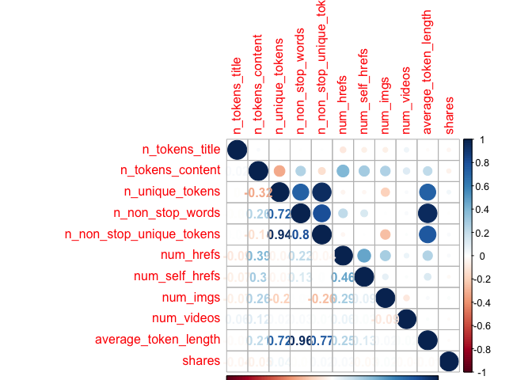
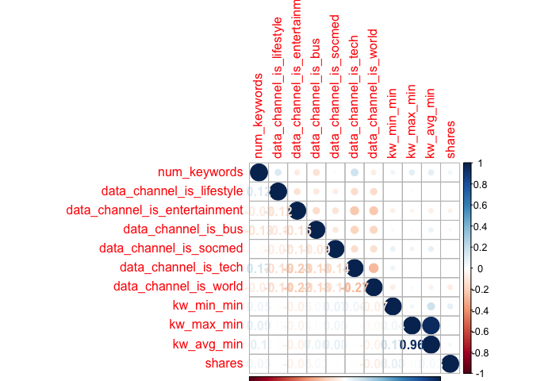
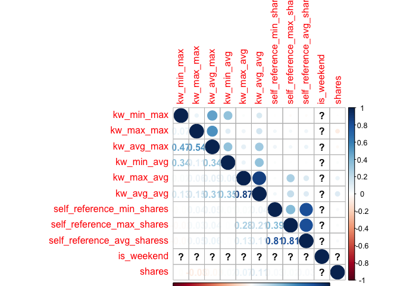
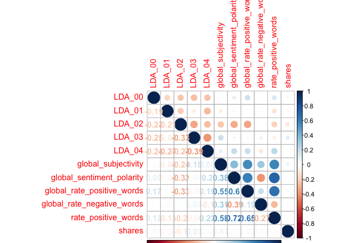
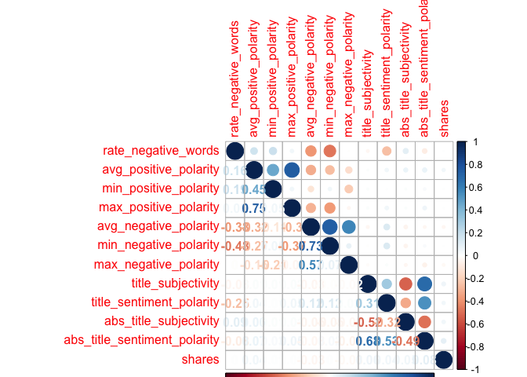

ST558\_PROJECT2
================
Qiaozhi Bao
2020/10/6

# Introduction

## Describe the data

The [Online News Popularity data
set](%22https://archive.ics.uci.edu/ml/datasets/Online+News+Popularity%22)
was published two years ago to summarize a heterogeneous set of features
about articles published by Mashable in a period of two years. There are
61 variables in total from the data set above: 58 predictive attributes,
2 non-predictive and 1 goal field.More details and summarization will be
discussed later in this project.

## The purpose of Analysis

The purpose of this analysis is to create two models(ensemble and not
ensemble) to generate the best predict of the response
attribute–shares.Our analysis will help to determine what kind of
content would be most popular.

## Methods

For this project,I first split the data into training set and test
set,then I examine the data with summary statistics and correlation
plots to see the relationships between predictive attributes and the
relationship between predictive attributes and response variables,then
some meaningless variables were moved. I then utilized the caret package
to create two models.Tree-based model chosen using leave one out cross
validation.Boosted tree model chosen using cross-validation.

# Data Study

## Description of the Used Data

As our study intention is to predict the popularity of an article, so we
choose the shares as the response variable.After plotting the
correlations between variables, we removed some high related predictive
variables. The two models were fitted by remaining variables in the
training set.

``` r
# Load all libraries
library(tidyverse)
library(ggplot2)
library(randomForest)
library(caret)
library(tree)
library(gbm)
library(corrplot)
library(e1071)
set.seed(1)
```

``` r
# Read in data and removing the first two columns as they are not predictive variables.
news_pop <- read_csv('./OnlineNewsPopularity.csv') %>% select(-`url`,-`timedelta`)
```

    ## Parsed with column specification:
    ## cols(
    ##   .default = col_double(),
    ##   url = col_character()
    ## )

    ## See spec(...) for full column specifications.

``` r
params$weekday
```

    ## [1] "weekday_is_saturday"

``` r
# First to see Monday data
data <- news_pop%>% select(!starts_with('weekday_is'),params$weekday)
# Check if we have missing values, answer is 'No'
sum(is.na(data))
```

    ## [1] 0

``` r
data <-data %>% filter(data[,53]==1) %>%select(-params$weekday)
```

As there is no missing value in our Monday data, we will step to split
data. By using sample(), with 70% of the data goes to the training set
(4,662 observations, Mon\_train) and 30% goes to the test set (1,999
observations, Mon\_test).

``` r
# Split Monday data,70% for training set and 30% for test set
set.seed(1)
train <- sample(1:nrow(data),size = nrow(data)*0.7)
test <- dplyr::setdiff(1:nrow(data),train)
train_data <-data[train,]
test_data <- data[test,]
```

# Data Summarizations

## Predictor Variables

I used the `summary()` function to calculate summary statistics for each
of the quantitative variables in data.I divided the data into trunks to
make plots easier to compare.

``` r
summary(train_data)
```

    ##  n_tokens_title  n_tokens_content n_unique_tokens  n_non_stop_words n_non_stop_unique_tokens
    ##  Min.   : 5.00   Min.   :   0.0   Min.   :0.0000   Min.   :0.000    Min.   :0.0000          
    ##  1st Qu.: 9.00   1st Qu.: 277.0   1st Qu.:0.4595   1st Qu.:1.000    1st Qu.:0.6116          
    ##  Median :10.00   Median : 496.0   Median :0.5199   Median :1.000    Median :0.6742          
    ##  Mean   :10.24   Mean   : 596.8   Mean   :0.5112   Mean   :0.961    Mean   :0.6530          
    ##  3rd Qu.:12.00   3rd Qu.: 781.0   3rd Qu.:0.5927   3rd Qu.:1.000    3rd Qu.:0.7361          
    ##  Max.   :18.00   Max.   :4046.0   Max.   :0.9574   Max.   :1.000    Max.   :1.0000          
    ##    num_hrefs      num_self_hrefs      num_imgs        num_videos     average_token_length
    ##  Min.   :  0.00   Min.   : 0.000   Min.   : 0.000   Min.   : 0.000   Min.   :0.000       
    ##  1st Qu.:  5.00   1st Qu.: 1.000   1st Qu.: 1.000   1st Qu.: 0.000   1st Qu.:4.475       
    ##  Median : 10.00   Median : 3.000   Median : 1.000   Median : 0.000   Median :4.666       
    ##  Mean   : 13.03   Mean   : 3.917   Mean   : 5.411   Mean   : 1.161   Mean   :4.507       
    ##  3rd Qu.: 17.00   3rd Qu.: 4.000   3rd Qu.: 8.000   3rd Qu.: 1.000   3rd Qu.:4.855       
    ##  Max.   :105.00   Max.   :74.000   Max.   :99.000   Max.   :74.000   Max.   :6.295       
    ##   num_keywords    data_channel_is_lifestyle data_channel_is_entertainment data_channel_is_bus
    ##  Min.   : 1.000   Min.   :0.0000            Min.   :0.0000                Min.   :0.0000     
    ##  1st Qu.: 6.000   1st Qu.:0.0000            1st Qu.:0.0000                1st Qu.:0.0000     
    ##  Median : 8.000   Median :0.0000            Median :0.0000                Median :0.0000     
    ##  Mean   : 7.547   Mean   :0.0728            Mean   :0.1555                Mean   :0.1043     
    ##  3rd Qu.: 9.000   3rd Qu.:0.0000            3rd Qu.:0.0000                3rd Qu.:0.0000     
    ##  Max.   :10.000   Max.   :1.0000            Max.   :1.0000                Max.   :1.0000     
    ##  data_channel_is_socmed data_channel_is_tech data_channel_is_world   kw_min_min    
    ##  Min.   :0.00000        Min.   :0.0000       Min.   :0.0000        Min.   : -1.00  
    ##  1st Qu.:0.00000        1st Qu.:0.0000       1st Qu.:0.0000        1st Qu.: -1.00  
    ##  Median :0.00000        Median :0.0000       Median :0.0000        Median : -1.00  
    ##  Mean   :0.06639        Mean   :0.2196       Mean   :0.2108        Mean   : 23.59  
    ##  3rd Qu.:0.00000        3rd Qu.:0.0000       3rd Qu.:0.0000        3rd Qu.:  4.00  
    ##  Max.   :1.00000        Max.   :1.0000       Max.   :1.0000        Max.   :217.00  
    ##    kw_max_min      kw_avg_min       kw_min_max       kw_max_max       kw_avg_max    
    ##  Min.   :    0   Min.   :  -1.0   Min.   :     0   Min.   : 37400   Min.   :  7178  
    ##  1st Qu.:  461   1st Qu.: 142.8   1st Qu.:     0   1st Qu.:843300   1st Qu.:170944  
    ##  Median :  695   Median : 244.1   Median :  1900   Median :843300   Median :239888  
    ##  Mean   : 1096   Mean   : 302.4   Mean   : 15659   Mean   :761791   Mean   :250369  
    ##  3rd Qu.: 1100   3rd Qu.: 362.9   3rd Qu.: 10800   3rd Qu.:843300   3rd Qu.:315360  
    ##  Max.   :50100   Max.   :8549.3   Max.   :843300   Max.   :843300   Max.   :843300  
    ##    kw_min_avg     kw_max_avg       kw_avg_avg    self_reference_min_shares
    ##  Min.   :   0   Min.   :  2414   Min.   : 1115   Min.   :     0           
    ##  1st Qu.:   0   1st Qu.:  3578   1st Qu.: 2505   1st Qu.:   681           
    ##  Median :1266   Median :  4662   Median : 3045   Median :  1300           
    ##  Mean   :1260   Mean   :  5982   Mean   : 3300   Mean   :  3753           
    ##  3rd Qu.:2212   3rd Qu.:  6620   3rd Qu.: 3839   3rd Qu.:  2700           
    ##  Max.   :3594   Max.   :237967   Max.   :36717   Max.   :663600           
    ##  self_reference_max_shares self_reference_avg_sharess   is_weekend     LDA_00       
    ##  Min.   :     0            Min.   :     0             Min.   :1    Min.   :0.02000  
    ##  1st Qu.:  1100            1st Qu.:  1000             1st Qu.:1    1st Qu.:0.02500  
    ##  Median :  2900            Median :  2350             Median :1    Median :0.03333  
    ##  Mean   : 10867            Mean   :  6087             Mean   :1    Mean   :0.16589  
    ##  3rd Qu.:  8200            3rd Qu.:  5200             3rd Qu.:1    3rd Qu.:0.19810  
    ##  Max.   :837700            Max.   :663600             Max.   :1    Max.   :0.91998  
    ##      LDA_01            LDA_02            LDA_03            LDA_04        global_subjectivity
    ##  Min.   :0.01819   Min.   :0.01832   Min.   :0.01821   Min.   :0.02000   Min.   :0.0000     
    ##  1st Qu.:0.02352   1st Qu.:0.02500   1st Qu.:0.02502   1st Qu.:0.02857   1st Qu.:0.4063     
    ##  Median :0.03333   Median :0.04000   Median :0.04000   Median :0.05000   Median :0.4630     
    ##  Mean   :0.13438   Mean   :0.21386   Mean   :0.22585   Mean   :0.26003   Mean   :0.4491     
    ##  3rd Qu.:0.13412   3rd Qu.:0.33416   3rd Qu.:0.38332   3rd Qu.:0.45662   3rd Qu.:0.5179     
    ##  Max.   :0.91996   Max.   :0.92000   Max.   :0.91997   Max.   :0.91999   Max.   :0.8125     
    ##  global_sentiment_polarity global_rate_positive_words global_rate_negative_words
    ##  Min.   :-0.2146           Min.   :0.00000            Min.   :0.000000          
    ##  1st Qu.: 0.0584           1st Qu.:0.02825            1st Qu.:0.009823          
    ##  Median : 0.1229           Median :0.04040            Median :0.015625          
    ##  Mean   : 0.1238           Mean   :0.04063            Mean   :0.016684          
    ##  3rd Qu.: 0.1893           3rd Qu.:0.05263            3rd Qu.:0.021906          
    ##  Max.   : 0.6000           Max.   :0.13065            Max.   :0.139831          
    ##  rate_positive_words rate_negative_words avg_positive_polarity min_positive_polarity
    ##  Min.   :0.0000      Min.   :0.0000      Min.   :0.0000        Min.   :0.00000      
    ##  1st Qu.:0.6000      1st Qu.:0.1818      1st Qu.:0.3126        1st Qu.:0.05000      
    ##  Median :0.7143      Median :0.2742      Median :0.3659        Median :0.10000      
    ##  Mean   :0.6778      Mean   :0.2832      Mean   :0.3567        Mean   :0.08906      
    ##  3rd Qu.:0.8000      3rd Qu.:0.3750      3rd Qu.:0.4167        3rd Qu.:0.10000      
    ##  Max.   :1.0000      Max.   :1.0000      Max.   :1.0000        Max.   :1.00000      
    ##  max_positive_polarity avg_negative_polarity min_negative_polarity max_negative_polarity
    ##  Min.   :0.0000        Min.   :-1.0000       Min.   :-1.0000       Min.   :-1.0000      
    ##  1st Qu.:0.6000        1st Qu.:-0.3396       1st Qu.:-0.8000       1st Qu.:-0.1250      
    ##  Median :0.8000        Median :-0.2607       Median :-0.5000       Median :-0.1000      
    ##  Mean   :0.7775        Mean   :-0.2668       Mean   :-0.5518       Mean   :-0.1037      
    ##  3rd Qu.:1.0000        3rd Qu.:-0.1988       3rd Qu.:-0.3889       3rd Qu.:-0.0500      
    ##  Max.   :1.0000        Max.   : 0.0000       Max.   : 0.0000       Max.   : 0.0000      
    ##  title_subjectivity title_sentiment_polarity abs_title_subjectivity
    ##  Min.   :0.0000     Min.   :-1.00000         Min.   :0.0000        
    ##  1st Qu.:0.0000     1st Qu.: 0.00000         1st Qu.:0.1250        
    ##  Median :0.2000     Median : 0.00000         Median :0.4500        
    ##  Mean   :0.2881     Mean   : 0.09693         Mean   :0.3276        
    ##  3rd Qu.:0.5000     3rd Qu.: 0.22500         3rd Qu.:0.5000        
    ##  Max.   :1.0000     Max.   : 1.00000         Max.   :0.5000        
    ##  abs_title_sentiment_polarity     shares      
    ##  Min.   :0.00000              Min.   :    49  
    ##  1st Qu.:0.00000              1st Qu.:  1400  
    ##  Median :0.03333              Median :  2000  
    ##  Mean   :0.16647              Mean   :  3806  
    ##  3rd Qu.:0.25000              3rd Qu.:  3700  
    ##  Max.   :1.00000              Max.   :144400

``` r
correlation1 <- cor(train_data[,c(1:10,52)])
corrplot(correlation1,type='upper',tl.pos = 'lt')
corrplot(correlation1,type='lower',method = 'number',add = T,diag = F,tl.pos = 'n')
```

<!-- -->

``` r
correlation2 <- cor(train_data[,c(11:20,52)])
corrplot(correlation2,type='upper',tl.pos = 'lt')
corrplot(correlation2,type='lower',method = 'number',add = T,diag = F,tl.pos = 'n')
```

<!-- -->

``` r
correlation3 <- cor(train_data[,c(21:30,52)])
```

    ## Warning in cor(train_data[, c(21:30, 52)]): the standard deviation is zero

``` r
corrplot(correlation3,type='upper',tl.pos = 'lt')
corrplot(correlation3,type='lower',method = 'number',add = T,diag = F,tl.pos = 'n')
```

<!-- -->

``` r
correlation4 <- cor(train_data[,c(31:40,52)])
corrplot(correlation4,type='upper',tl.pos = 'lt')
corrplot(correlation4,type='lower',method = 'number',add = T,diag = F,tl.pos = 'n')
```

<!-- -->

``` r
correlation5 <- cor(train_data[,c(41:51,52)])
corrplot(correlation5,type='upper',tl.pos = 'lt')
corrplot(correlation5,type='lower',method = 'number',add = T,diag = F,tl.pos = 'n')
```

<!-- -->

Unfortunately I did not find any variables are strongly related with the
response,so my plan is remove some highly correlated predictive
variables. From the correlation plot,I decided to remove some
meaningless variables:`is_weekend`,variables start with “LDA”. Also some
highly correlated variables will be removed too,like variables start
with“kw”,then we will get a new train set and test set.

``` r
#Remove meaningless variables
train_data <- train_data %>% select(!starts_with("LDA"),-is_weekend)
test_data <- test_data %>% select(!starts_with("LDA"),-is_weekend)
train_data <- train_data %>% select(!starts_with('kw'))
test_data <- train_data %>% select(!starts_with('kw'))
```

# First Model

## Tree based model chosen using leave one out cross validation

``` r
tree.method <- train(shares ~.,data = train_data,method='rpart',
                       preProcess = c("center","scale"),
                     trControl = trainControl(method ='LOOCV'))
tree.method$results
tree.method$bestTune
```

# Second Model

## Boosted tree model chosen using cross-validation

``` r
# We will fit the model using repeated CV
boosted.method <- train(shares ~.,data = train_data,method = 'gbm',
                      trControl = trainControl(method = 'repeatedcv', number=5,repeats =2),
                      preProcess = c("center","scale"),
                      verbose = FALSE)

boosted.method$results
boosted.method$bestTune
```

## Compare RMSE

We will make predictions using beset model fits and test set to compare
the RMSE of the two models.We will choose the model with a smaller RMSE
as our optimal model.

``` r
# predict values on test set and compare RMSE for two models
pred.tree <- predict(tree.method,test_data)
pred.boost <- predict(boosted.method,test_data)
compare <- rbind(postResample(pred.tree,test_data$shares),postResample(pred.boost,test_data$shares))
rownames(compare)<-c("Tree method","Boosted method")
compare
```

    ##                    RMSE   Rsquared      MAE
    ## Tree method    6752.639         NA 2996.058
    ## Boosted method 6535.142 0.07014614 2926.383

We generates two very similar RMSE,the smaller is preferred. In this
case,we can see the boosted method generates smaller RMSE which is the
same as we expected.The boosted method tend to have a better prediction
than the tree based method.
