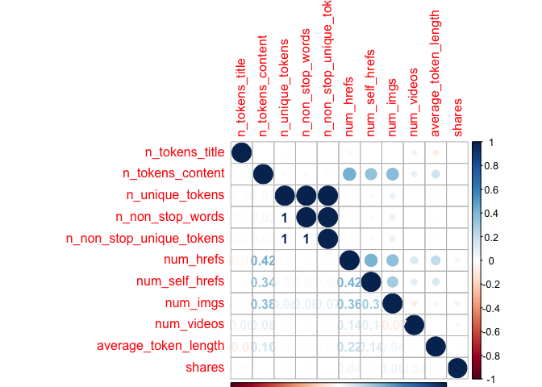
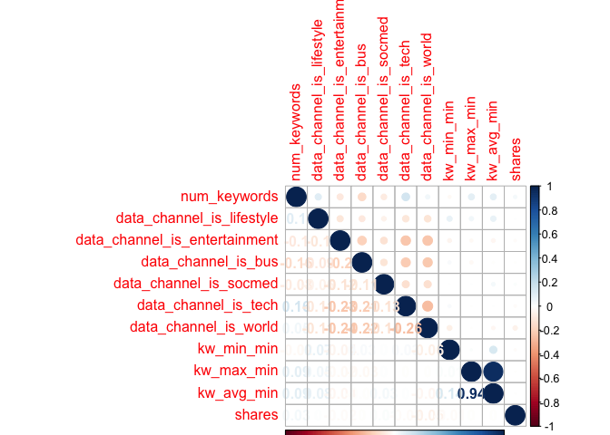
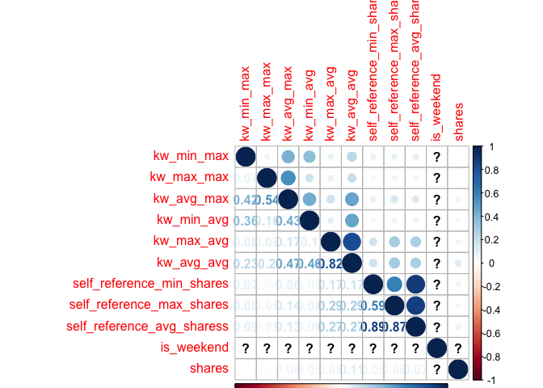
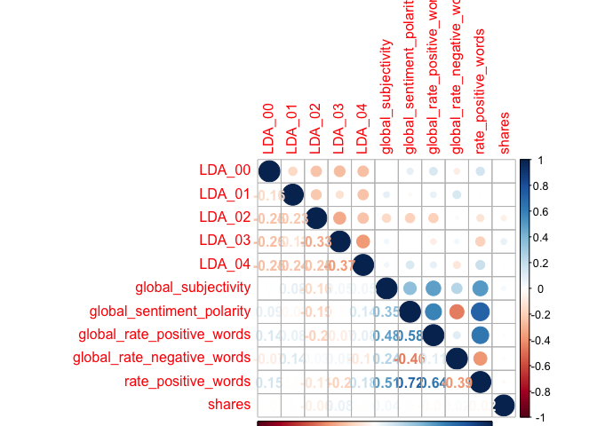
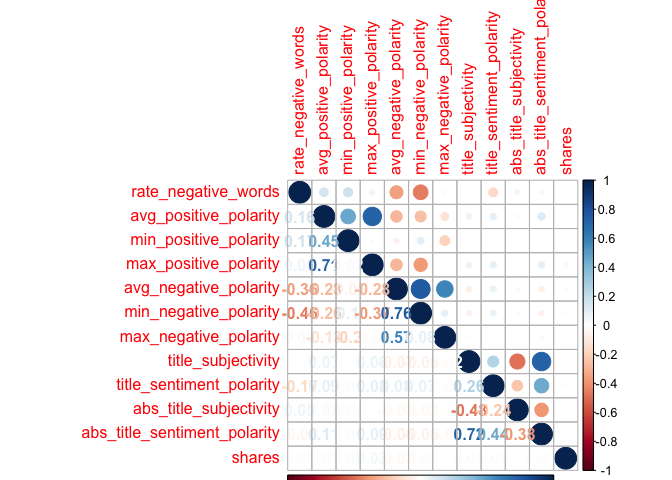

ST558\_PROJECT2
================
Qiaozhi Bao
2020/10/6

# Introduction

## Describe the data

The [Online News Popularity data
set](%22https://archive.ics.uci.edu/ml/datasets/Online+News+Popularity%22)
was published two years ago to summarize a heterogeneous set of features
about articles published by Mashable in a period of two years. There are
61 variables in total from the data set above: 58 predictive attributes,
2 non-predictive and 1 goal field.More details and summarization will be
discussed later in this project.

## The purpose of Analysis

The purpose of this analysis is to create two models(ensemble and not
ensemble) to generate the best predict of the response
attribute–shares.Our analysis will help to determine what kind of
content would be most popular.

## Methods

For this project,I first split the data into training set and test
set,then I examine the data with summary statistics and correlation
plots to see the relationships between predictive attributes and the
relationship between predictive attributes and response variables,then
some meaningless variables were moved. I then utilized the caret package
to create two models.Tree-based model chosen using leave one out cross
validation.Boosted tree model chosen using cross-validation.

# Data Study

## Description of the Used Data

As our study intention is to predict the popularity of an article, so we
choose the shares as the response variable.After plotting the
correlations between variables, we removed some high related predictive
variables. The two models were fitted by remaining variables in the
training set.

``` r
# Load all libraries
library(tidyverse)
library(ggplot2)
library(randomForest)
library(caret)
library(tree)
library(gbm)
library(corrplot)
library(e1071)
set.seed(1)
```

``` r
# Read in data and removing the first two columns as they are not predictive variables.
news_pop <- read_csv('./OnlineNewsPopularity.csv') %>% select(-`url`,-`timedelta`)
```

    ## Parsed with column specification:
    ## cols(
    ##   .default = col_double(),
    ##   url = col_character()
    ## )

    ## See spec(...) for full column specifications.

``` r
params$weekday
```

    ## [1] "weekday_is_tuesday"

``` r
# First to see Monday data
data <- news_pop%>% select(!starts_with('weekday_is'),params$weekday)
# Check if we have missing values, answer is 'No'
sum(is.na(data))
```

    ## [1] 0

``` r
data <-data %>% filter(data[,53]==1) %>%select(-params$weekday)
```

As there is no missing value in our Monday data, we will step to split
data. By using sample(), with 70% of the data goes to the training set
(4,662 observations, Mon\_train) and 30% goes to the test set (1,999
observations, Mon\_test).

``` r
# Split Monday data,70% for training set and 30% for test set
set.seed(1)
train <- sample(1:nrow(data),size = nrow(data)*0.7)
test <- dplyr::setdiff(1:nrow(data),train)
train_data <-data[train,]
test_data <- data[test,]
```

# Data Summarizations

## Predictor Variables

I used the `summary()` function to calculate summary statistics for each
of the quantitative variables in data.I divided the data into trunks to
make plots easier to compare.

``` r
summary(train_data)
```

    ##  n_tokens_title  n_tokens_content n_unique_tokens    n_non_stop_words  
    ##  Min.   : 4.00   Min.   :   0.0   Min.   :  0.0000   Min.   :   0.000  
    ##  1st Qu.: 9.00   1st Qu.: 246.0   1st Qu.:  0.4723   1st Qu.:   1.000  
    ##  Median :10.00   Median : 398.0   Median :  0.5412   Median :   1.000  
    ##  Mean   :10.46   Mean   : 543.4   Mean   :  0.6662   Mean   :   1.171  
    ##  3rd Qu.:12.00   3rd Qu.: 689.0   3rd Qu.:  0.6098   3rd Qu.:   1.000  
    ##  Max.   :19.00   Max.   :7081.0   Max.   :701.0000   Max.   :1042.000  
    ##  n_non_stop_unique_tokens   num_hrefs      num_self_hrefs      num_imgs      
    ##  Min.   :  0.0000         Min.   :  0.00   Min.   : 0.000   Min.   :  0.000  
    ##  1st Qu.:  0.6293         1st Qu.:  4.00   1st Qu.: 1.000   1st Qu.:  1.000  
    ##  Median :  0.6914         Median :  7.00   Median : 3.000   Median :  1.000  
    ##  Mean   :  0.7984         Mean   : 10.65   Mean   : 3.325   Mean   :  4.457  
    ##  3rd Qu.:  0.7553         3rd Qu.: 13.00   3rd Qu.: 4.000   3rd Qu.:  3.000  
    ##  Max.   :650.0000         Max.   :304.00   Max.   :62.000   Max.   :100.000  
    ##    num_videos    average_token_length  num_keywords    data_channel_is_lifestyle
    ##  Min.   : 0.00   Min.   :0.000        Min.   : 1.000   Min.   :0.00000          
    ##  1st Qu.: 0.00   1st Qu.:4.473        1st Qu.: 6.000   1st Qu.:0.00000          
    ##  Median : 0.00   Median :4.663        Median : 7.000   Median :0.00000          
    ##  Mean   : 1.33   Mean   :4.540        Mean   : 7.167   Mean   :0.04523          
    ##  3rd Qu.: 1.00   3rd Qu.:4.853        3rd Qu.: 9.000   3rd Qu.:0.00000          
    ##  Max.   :59.00   Max.   :7.975        Max.   :10.000   Max.   :1.00000          
    ##  data_channel_is_entertainment data_channel_is_bus data_channel_is_socmed
    ##  Min.   :0.0000                Min.   :0.0000      Min.   :0.00000       
    ##  1st Qu.:0.0000                1st Qu.:0.0000      1st Qu.:0.00000       
    ##  Median :0.0000                Median :0.0000      Median :0.00000       
    ##  Mean   :0.1746                Mean   :0.1531      Mean   :0.06418       
    ##  3rd Qu.:0.0000                3rd Qu.:0.0000      3rd Qu.:0.00000       
    ##  Max.   :1.0000                Max.   :1.0000      Max.   :1.00000       
    ##  data_channel_is_tech data_channel_is_world   kw_min_min       kw_max_min    
    ##  Min.   :0.0000       Min.   :0.0000        Min.   : -1.00   Min.   :     0  
    ##  1st Qu.:0.0000       1st Qu.:0.0000        1st Qu.: -1.00   1st Qu.:   440  
    ##  Median :0.0000       Median :0.0000        Median : -1.00   Median :   656  
    ##  Mean   :0.2014       Mean   :0.2138        Mean   : 25.02   Mean   :  1131  
    ##  3rd Qu.:0.0000       3rd Qu.:0.0000        3rd Qu.:  4.00   3rd Qu.:  1000  
    ##  Max.   :1.0000       Max.   :1.0000        Max.   :217.00   Max.   :139600  
    ##    kw_avg_min        kw_min_max       kw_max_max       kw_avg_max       kw_min_avg    
    ##  Min.   :   -1.0   Min.   :     0   Min.   : 17100   Min.   :  3617   Min.   :   0.0  
    ##  1st Qu.:  139.1   1st Qu.:     0   1st Qu.:843300   1st Qu.:171550   1st Qu.:   0.0  
    ##  Median :  232.2   Median :  1300   Median :843300   Median :243857   Median : 991.6  
    ##  Mean   :  307.7   Mean   : 13975   Mean   :755769   Mean   :262216   Mean   :1109.4  
    ##  3rd Qu.:  357.0   3rd Qu.:  8600   3rd Qu.:843300   3rd Qu.:335554   3rd Qu.:2062.6  
    ##  Max.   :15851.2   Max.   :843300   Max.   :843300   Max.   :843300   Max.   :3609.7  
    ##    kw_max_avg       kw_avg_avg      self_reference_min_shares self_reference_max_shares
    ##  Min.   :  2019   Min.   :  804.4   Min.   :     0            Min.   :     0           
    ##  1st Qu.:  3529   1st Qu.: 2368.3   1st Qu.:   636            1st Qu.:  1100           
    ##  Median :  4286   Median : 2842.3   Median :  1200            Median :  2900           
    ##  Mean   :  5619   Mean   : 3129.8   Mean   :  4196            Mean   : 10221           
    ##  3rd Qu.:  6020   3rd Qu.: 3575.9   3rd Qu.:  2700            3rd Qu.:  7900           
    ##  Max.   :178675   Max.   :29240.8   Max.   :690400            Max.   :843300           
    ##  self_reference_avg_sharess   is_weekend     LDA_00            LDA_01       
    ##  Min.   :     0             Min.   :0    Min.   :0.00000   Min.   :0.00000  
    ##  1st Qu.:   992             1st Qu.:0    1st Qu.:0.02506   1st Qu.:0.02501  
    ##  Median :  2250             Median :0    Median :0.03337   Median :0.03334  
    ##  Mean   :  6450             Mean   :0    Mean   :0.17780   Mean   :0.13432  
    ##  3rd Qu.:  5200             3rd Qu.:0    3rd Qu.:0.22811   3rd Qu.:0.13268  
    ##  Max.   :690400             Max.   :0    Max.   :0.91998   Max.   :0.91994  
    ##      LDA_02            LDA_03            LDA_04        global_subjectivity
    ##  Min.   :0.00000   Min.   :0.00000   Min.   :0.00000   Min.   :0.0000     
    ##  1st Qu.:0.02857   1st Qu.:0.02857   1st Qu.:0.02858   1st Qu.:0.3952     
    ##  Median :0.04004   Median :0.04000   Median :0.05000   Median :0.4516     
    ##  Mean   :0.21945   Mean   :0.22107   Mean   :0.24718   Mean   :0.4404     
    ##  3rd Qu.:0.33900   3rd Qu.:0.35652   3rd Qu.:0.44016   3rd Qu.:0.5052     
    ##  Max.   :0.92000   Max.   :0.91997   Max.   :0.92719   Max.   :0.8420     
    ##  global_sentiment_polarity global_rate_positive_words global_rate_negative_words
    ##  Min.   :-0.30881          Min.   :0.00000            Min.   :0.000000          
    ##  1st Qu.: 0.05682          1st Qu.:0.02829            1st Qu.:0.009317          
    ##  Median : 0.11964          Median :0.03881            Median :0.015038          
    ##  Mean   : 0.11855          Mean   :0.03933            Mean   :0.016257          
    ##  3rd Qu.: 0.17639          3rd Qu.:0.04967            3rd Qu.:0.021244          
    ##  Max.   : 0.61923          Max.   :0.10714            Max.   :0.081352          
    ##  rate_positive_words rate_negative_words avg_positive_polarity min_positive_polarity
    ##  Min.   :0.0000      Min.   :0.0000      Min.   :0.0000        Min.   :0.00000      
    ##  1st Qu.:0.6000      1st Qu.:0.1842      1st Qu.:0.3045        1st Qu.:0.05000      
    ##  Median :0.7143      Median :0.2727      Median :0.3558        Median :0.10000      
    ##  Mean   :0.6843      Mean   :0.2845      Mean   :0.3496        Mean   :0.09483      
    ##  3rd Qu.:0.8000      3rd Qu.:0.3793      3rd Qu.:0.4069        3rd Qu.:0.10000      
    ##  Max.   :1.0000      Max.   :1.0000      Max.   :0.8333        Max.   :0.70000      
    ##  max_positive_polarity avg_negative_polarity min_negative_polarity max_negative_polarity
    ##  Min.   :0.0000        Min.   :-1.0000       Min.   :-1.0000       Min.   :-1.0000      
    ##  1st Qu.:0.6000        1st Qu.:-0.3250       1st Qu.:-0.7000       1st Qu.:-0.1250      
    ##  Median :0.8000        Median :-0.2500       Median :-0.5000       Median :-0.1000      
    ##  Mean   :0.7492        Mean   :-0.2557       Mean   :-0.5144       Mean   :-0.1069      
    ##  3rd Qu.:1.0000        3rd Qu.:-0.1826       3rd Qu.:-0.3000       3rd Qu.:-0.0500      
    ##  Max.   :1.0000        Max.   : 0.0000       Max.   : 0.0000       Max.   : 0.0000      
    ##  title_subjectivity title_sentiment_polarity abs_title_subjectivity
    ##  Min.   :0.000      Min.   :-1.00000         Min.   :0.0000        
    ##  1st Qu.:0.000      1st Qu.: 0.00000         1st Qu.:0.1667        
    ##  Median :0.100      Median : 0.00000         Median :0.5000        
    ##  Mean   :0.274      Mean   : 0.07309         Mean   :0.3478        
    ##  3rd Qu.:0.500      3rd Qu.: 0.13636         3rd Qu.:0.5000        
    ##  Max.   :1.000      Max.   : 1.00000         Max.   :0.5000        
    ##  abs_title_sentiment_polarity     shares      
    ##  Min.   :0.0000               Min.   :    45  
    ##  1st Qu.:0.0000               1st Qu.:   893  
    ##  Median :0.0000               Median :  1300  
    ##  Mean   :0.1505               Mean   :  3185  
    ##  3rd Qu.:0.2500               3rd Qu.:  2500  
    ##  Max.   :1.0000               Max.   :441000

``` r
correlation1 <- cor(train_data[,c(1:10,52)])
corrplot(correlation1,type='upper',tl.pos = 'lt')
corrplot(correlation1,type='lower',method = 'number',add = T,diag = F,tl.pos = 'n')
```

<!-- -->

``` r
correlation2 <- cor(train_data[,c(11:20,52)])
corrplot(correlation2,type='upper',tl.pos = 'lt')
corrplot(correlation2,type='lower',method = 'number',add = T,diag = F,tl.pos = 'n')
```

<!-- -->

``` r
correlation3 <- cor(train_data[,c(21:30,52)])
```

    ## Warning in cor(train_data[, c(21:30, 52)]): the standard deviation is zero

``` r
corrplot(correlation3,type='upper',tl.pos = 'lt')
corrplot(correlation3,type='lower',method = 'number',add = T,diag = F,tl.pos = 'n')
```

<!-- -->

``` r
correlation4 <- cor(train_data[,c(31:40,52)])
corrplot(correlation4,type='upper',tl.pos = 'lt')
corrplot(correlation4,type='lower',method = 'number',add = T,diag = F,tl.pos = 'n')
```

<!-- -->

``` r
correlation5 <- cor(train_data[,c(41:51,52)])
corrplot(correlation5,type='upper',tl.pos = 'lt')
corrplot(correlation5,type='lower',method = 'number',add = T,diag = F,tl.pos = 'n')
```

<!-- -->

Unfortunately I did not find any variables are strongly related with the
response,so my plan is remove some highly correlated predictive
variables. From the correlation plot,I decided to remove some
meaningless variables:`is_weekend`,variables start with “LDA”. Also some
highly correlated variables will be removed too,like variables start
with“kw”,then we will get a new train set and test set.

``` r
#Remove meaningless variables
train_data <- train_data %>% select(!starts_with("LDA"),-is_weekend)
test_data <- test_data %>% select(!starts_with("LDA"),-is_weekend)
train_data <- train_data %>% select(!starts_with('kw'))
test_data <- train_data %>% select(!starts_with('kw'))
```

# First Model

## Tree based model chosen using leave one out cross validation

``` r
tree.method <- train(shares ~.,data = train_data,method='rpart',
                       preProcess = c("center","scale"),
                     trControl = trainControl(method ='LOOCV'))
tree.method$results
tree.method$bestTune
```

# Second Model

## Boosted tree model chosen using cross-validation

``` r
# We will fit the model using repeated CV
boosted.method <- train(shares ~.,data = train_data,method = 'gbm',
                      trControl = trainControl(method = 'repeatedcv', number=5,repeats =2),
                      preProcess = c("center","scale"),
                      verbose = FALSE)
boosted.method$results
boosted.method$bestTune
```

# Second Analysis

## Linear model

As we already removed some predictor variables based on collinearity,to
simplify the variable selection we just pick some significant variables
from the linear fit model,then pick a model from the candidate models.

We picked `num_hrefs`, `tt{average_token_length`,
`data_channel_is_lifestyle`, `data_channel_is_entertainment`,
`data_channel_is_bus`,
`data_channel_is_socmed`,`data_channel_is_tech`,`data_channel_is_world`,`self_reference_min_shares`.

``` r
# fit a linear model
lm.fit <- lm(shares ~., data=train_data)
summary(lm.fit)
```

    ## 
    ## Call:
    ## lm(formula = shares ~ ., data = train_data)
    ## 
    ## Residuals:
    ##    Min     1Q Median     3Q    Max 
    ## -15090  -2248  -1282   -111 433924 
    ## 
    ## Coefficients:
    ##                                 Estimate Std. Error t value Pr(>|t|)    
    ## (Intercept)                    2.733e+03  1.329e+03   2.056 0.039841 *  
    ## n_tokens_title                 7.888e+01  6.853e+01   1.151 0.249799    
    ## n_tokens_content              -3.976e-01  5.144e-01  -0.773 0.439558    
    ## n_unique_tokens                5.717e+03  4.585e+03   1.247 0.212481    
    ## n_non_stop_words              -1.310e+03  1.565e+03  -0.837 0.402637    
    ## n_non_stop_unique_tokens      -4.058e+03  3.877e+03  -1.047 0.295306    
    ## num_hrefs                      1.853e+01  1.490e+01   1.244 0.213573    
    ## num_self_hrefs                -2.148e+01  4.561e+01  -0.471 0.637724    
    ## num_imgs                       4.918e+01  2.167e+01   2.269 0.023289 *  
    ## num_videos                     3.476e+01  3.820e+01   0.910 0.362900    
    ## average_token_length          -7.039e+02  5.632e+02  -1.250 0.211411    
    ## num_keywords                   1.531e+02  7.711e+01   1.985 0.047146 *  
    ## data_channel_is_lifestyle     -1.101e+03  8.004e+02  -1.376 0.168948    
    ## data_channel_is_entertainment -1.960e+03  5.281e+02  -3.712 0.000207 ***
    ## data_channel_is_bus           -8.141e+02  5.926e+02  -1.374 0.169619    
    ## data_channel_is_socmed        -4.361e+02  7.136e+02  -0.611 0.541215    
    ## data_channel_is_tech          -1.510e+03  5.659e+02  -2.667 0.007672 ** 
    ## data_channel_is_world         -1.952e+03  5.759e+02  -3.389 0.000706 ***
    ## self_reference_min_shares     -1.921e-02  2.167e-02  -0.887 0.375376    
    ## self_reference_max_shares     -1.319e-02  1.182e-02  -1.116 0.264546    
    ## self_reference_avg_sharess     5.381e-02  3.075e-02   1.750 0.080207 .  
    ## global_subjectivity            5.166e+03  2.058e+03   2.510 0.012110 *  
    ## global_sentiment_polarity     -1.013e+03  4.042e+03  -0.251 0.802026    
    ## global_rate_positive_words    -2.602e+04  1.822e+04  -1.428 0.153453    
    ## global_rate_negative_words     8.093e+03  3.593e+04   0.225 0.821804    
    ## rate_positive_words            1.896e+03  3.342e+03   0.567 0.570415    
    ## rate_negative_words            1.799e+03  3.828e+03   0.470 0.638347    
    ## avg_positive_polarity         -5.723e+03  3.294e+03  -1.737 0.082371 .  
    ## min_positive_polarity          2.526e+03  2.854e+03   0.885 0.376101    
    ## max_positive_polarity          3.536e+03  1.019e+03   3.471 0.000523 ***
    ## avg_negative_polarity         -1.116e+03  3.039e+03  -0.367 0.713459    
    ## min_negative_polarity          1.916e+02  1.105e+03   0.173 0.862316    
    ## max_negative_polarity          2.942e+03  2.587e+03   1.137 0.255469    
    ## title_subjectivity            -3.365e+02  6.607e+02  -0.509 0.610540    
    ## title_sentiment_polarity       5.471e+02  6.164e+02   0.888 0.374808    
    ## abs_title_subjectivity        -2.627e+02  8.741e+02  -0.301 0.763746    
    ## abs_title_sentiment_polarity  -2.645e+02  9.589e+02  -0.276 0.782717    
    ## ---
    ## Signif. codes:  0 '***' 0.001 '**' 0.01 '*' 0.05 '.' 0.1 ' ' 1
    ## 
    ## Residual standard error: 9945 on 5136 degrees of freedom
    ## Multiple R-squared:  0.02206,    Adjusted R-squared:  0.01521 
    ## F-statistic: 3.218 on 36 and 5136 DF,  p-value: 3.519e-10

Then we will fit some candidate models to select.

``` r
# Candidate models
fit1 <- train(shares ~ num_hrefs, train_data,
             method='lm',
             trControl = trainControl(method = 'cv',number=10))
fit1$results$RMSE
```

    ## [1] 8642.065

``` r
fit2 <- train(shares ~ num_hrefs+average_token_length, train_data,
             method='lm',
             trControl = trainControl(method = 'cv',number=10))
fit2$results$RMSE
```

    ## [1] 8672.556

``` r
fit3 <- train(shares ~ num_hrefs+average_token_length
              +data_channel_is_lifestyle, train_data,
             method='lm',
             trControl = trainControl(method = 'cv',number=10))
fit3$results$RMSE
```

    ## [1] 8724.892

``` r
fit4 <- train(shares ~ num_hrefs+average_token_length
              +data_channel_is_lifestyle+data_channel_is_entertainment, train_data,
             method='lm',
             trControl = trainControl(method = 'cv',number=10))
fit4$results$RMSE
```

    ## [1] 8786.022

``` r
fit5 <- train(shares ~ num_hrefs+average_token_length
              +data_channel_is_lifestyle+data_channel_is_entertainment
              +data_channel_is_bus, train_data,
             method='lm',
             trControl = trainControl(method = 'cv',number=10))
fit5$results$RMSE
```

    ## [1] 8976.562

``` r
fit6 <- train(shares ~ num_hrefs+average_token_length
              +data_channel_is_lifestyle+data_channel_is_entertainment
              +data_channel_is_bus+data_channel_is_socmed, train_data,
             method='lm',
             trControl = trainControl(method = 'cv',number=10))
fit6$results$RMSE
```

    ## [1] 8922.157

``` r
fit7<- train(shares ~ num_hrefs+average_token_length
              +data_channel_is_lifestyle+data_channel_is_entertainment
              +data_channel_is_bus+data_channel_is_socmed+data_channel_is_tech, train_data,
             method='lm',
             trControl = trainControl(method = 'cv',number=10))
fit7$results$RMSE
```

    ## [1] 8903.055

``` r
fit8 <- train(shares ~ num_hrefs+average_token_length
              +data_channel_is_lifestyle+data_channel_is_entertainment
              +data_channel_is_bus+data_channel_is_socmed+data_channel_is_tech+
              data_channel_is_world,
              train_data,method='lm',
             trControl = trainControl(method = 'cv',number=10))
fit8$results$RMSE
```

    ## [1] 8749.834

``` r
fit9 <- train(shares ~ num_hrefs+average_token_length
              +data_channel_is_lifestyle+data_channel_is_entertainment
              +data_channel_is_bus+data_channel_is_socmed+data_channel_is_tech+
              data_channel_is_world+self_reference_min_shares,
              train_data,method='lm',
             trControl = trainControl(method = 'cv',number=10))
fit9$results$RMSE
```

    ## [1] 8160.173

Model fit7 has the lowest training RMSE with 7 variables, so we pick
this model as our optimal model for further evaluation on test set.

``` r
# final linear model
lm.fit.final <- as.formula(shares ~ num_hrefs+average_token_length
              +data_channel_is_lifestyle+data_channel_is_entertainment
              +data_channel_is_bus+data_channel_is_socmed+data_channel_is_tech)
```

Now we will calculate the test RMSE on test set for the picked linear
model.

``` r
final.fit <- train(as.formula(shares ~ num_hrefs+average_token_length
              +data_channel_is_lifestyle+data_channel_is_entertainment
              +data_channel_is_bus+data_channel_is_socmed+data_channel_is_tech),
              test_data,method='lm',
              trControl = trainControl(method = 'cv',number=5))
final.fit$results$RMSE
```

    ## [1] 9216.665

## Compare RMSE

We will make predictions using beset model fits and test set to compare
the RMSE of the three models.We will choose the model with a smaller
RMSE as our final optimal model.

``` r
# predict values on test set and compare RMSE for two models
pred.tree <- predict(tree.method,test_data)
pred.boost <- predict(boosted.method,test_data)
tree.rmse <- sqrt(mean((pred.tree-test_data$shares)^2))
boost.rmse <- sqrt(mean((pred.boost-test_data$shares)^2))
compare <- cbind(tree.rmse,boost.rmse,final.fit$results$RMSE)
colnames(compare)<-c("Tree method","Boosted method","Linear Model")
compare
```

    ##      Tree method Boosted method Linear Model
    ## [1,]    10020.63       9865.609     9216.665

In this case,we can see the linear model generates the smallest RMSE.The
linear model tend to have a better prediction than the tree based method
and boosted method.
