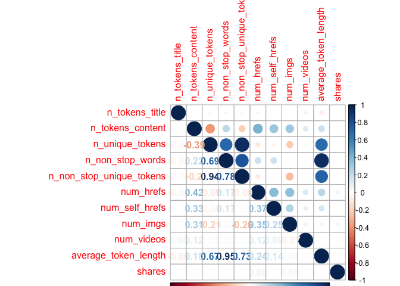
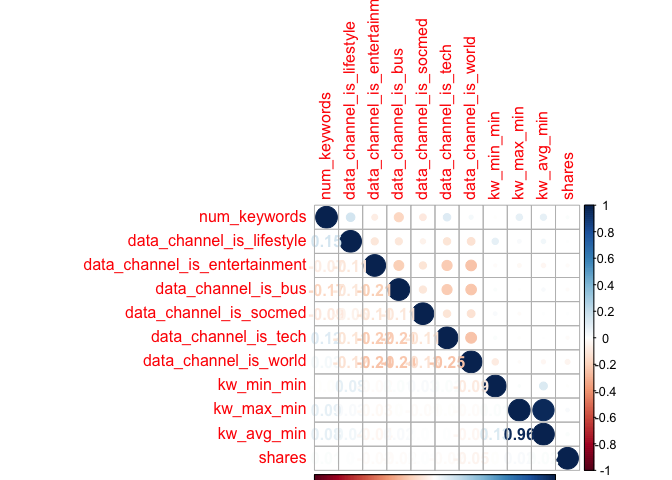
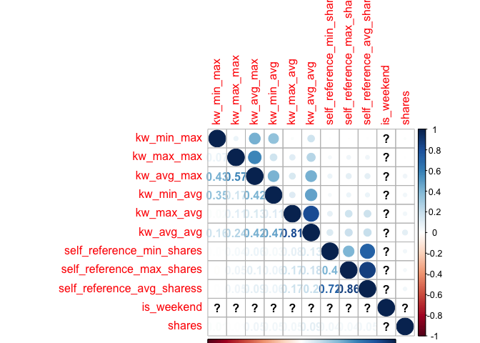
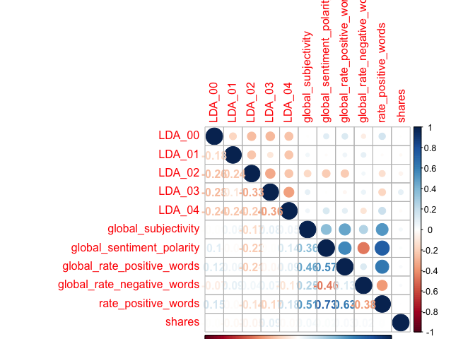
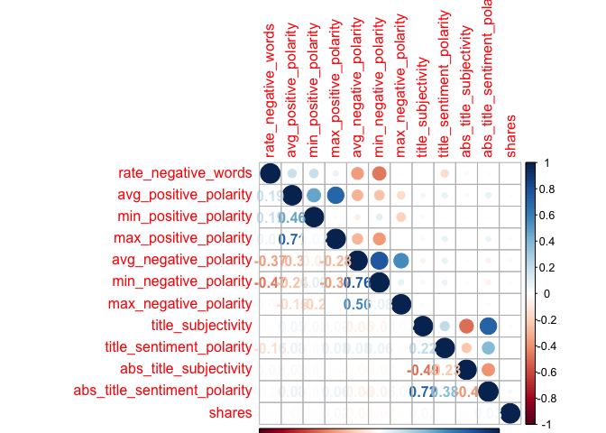

ST558\_PROJECT2
================
Qiaozhi Bao
2020/10/6

# Introduction

## Describe the data

The [Online News Popularity data
set](%22https://archive.ics.uci.edu/ml/datasets/Online+News+Popularity%22)
was published two years ago to summarize a heterogeneous set of features
about articles published by Mashable in a period of two years. There are
61 variables in total from the data set above: 58 predictive attributes,
2 non-predictive and 1 goal field.More details and summarization will be
discussed later in this project.

## The purpose of Analysis

The purpose of this analysis is to create two models(ensemble and not
ensemble) to generate the best predict of the response
attribute–shares.Our analysis will help to determine what kind of
content would be most popular.

## Methods

For this project,I first split the data into training set and test
set,then I examine the data with summary statistics and correlation
plots to see the relationships between predictive attributes and the
relationship between predictive attributes and response variables,then
some meaningless variables were moved. I then utilized the caret package
to create two models.Tree-based model chosen using leave one out cross
validation.Boosted tree model chosen using cross-validation.

# Data Study

## Description of the Used Data

As our study intention is to predict the popularity of an article, so we
choose the shares as the response variable.After plotting the
correlations between variables, we removed some high related predictive
variables. The two models were fitted by remaining variables in the
training set.

``` r
# Load all libraries
library(tidyverse)
library(ggplot2)
library(randomForest)
library(caret)
library(tree)
library(gbm)
library(corrplot)
library(e1071)
set.seed(1)
```

``` r
# Read in data and removing the first two columns as they are not predictive variables.
news_pop <- read_csv('./OnlineNewsPopularity.csv') %>% select(-`url`,-`timedelta`)
```

    ## Parsed with column specification:
    ## cols(
    ##   .default = col_double(),
    ##   url = col_character()
    ## )

    ## See spec(...) for full column specifications.

``` r
params$weekday
```

    ## [1] "weekday_is_wednesday"

``` r
# First to see Monday data
data <- news_pop%>% select(!starts_with('weekday_is'),params$weekday)
# Check if we have missing values, answer is 'No'
sum(is.na(data))
```

    ## [1] 0

``` r
data <-data %>% filter(data[,53]==1) %>%select(-params$weekday)
```

As there is no missing value in our Monday data, we will step to split
data. By using sample(), with 70% of the data goes to the training set
(4,662 observations, Mon\_train) and 30% goes to the test set (1,999
observations, Mon\_test).

``` r
# Split Monday data,70% for training set and 30% for test set
set.seed(1)
train <- sample(1:nrow(data),size = nrow(data)*0.7)
test <- dplyr::setdiff(1:nrow(data),train)
train_data <-data[train,]
test_data <- data[test,]
```

# Data Summarizations

## Predictor Variables

I used the `summary()` function to calculate summary statistics for each
of the quantitative variables in data.I divided the data into trunks to
make plots easier to compare.

``` r
summary(train_data)
```

    ##  n_tokens_title  n_tokens_content n_unique_tokens  n_non_stop_words
    ##  Min.   : 4.00   Min.   :   0.0   Min.   :0.0000   Min.   :0.0000  
    ##  1st Qu.: 9.00   1st Qu.: 243.0   1st Qu.:0.4707   1st Qu.:1.0000  
    ##  Median :10.00   Median : 400.0   Median :0.5415   Median :1.0000  
    ##  Mean   :10.43   Mean   : 528.1   Mean   :0.5322   Mean   :0.9685  
    ##  3rd Qu.:12.00   3rd Qu.: 696.0   3rd Qu.:0.6126   3rd Qu.:1.0000  
    ##  Max.   :18.00   Max.   :4747.0   Max.   :0.9375   Max.   :1.0000  
    ##  n_non_stop_unique_tokens   num_hrefs      num_self_hrefs      num_imgs     
    ##  Min.   :0.0000           Min.   :  0.00   Min.   : 0.000   Min.   : 0.000  
    ##  1st Qu.:0.6277           1st Qu.:  4.00   1st Qu.: 1.000   1st Qu.: 1.000  
    ##  Median :0.6947           Median :  7.00   Median : 2.000   Median : 1.000  
    ##  Mean   :0.6752           Mean   : 10.18   Mean   : 3.113   Mean   : 4.074  
    ##  3rd Qu.:0.7583           3rd Qu.: 13.00   3rd Qu.: 4.000   3rd Qu.: 3.000  
    ##  Max.   :1.0000           Max.   :150.00   Max.   :41.000   Max.   :92.000  
    ##    num_videos     average_token_length  num_keywords    data_channel_is_lifestyle
    ##  Min.   : 0.000   Min.   :0.000        Min.   : 1.000   Min.   :0.00000          
    ##  1st Qu.: 0.000   1st Qu.:4.476        1st Qu.: 6.000   1st Qu.:0.00000          
    ##  Median : 0.000   Median :4.665        Median : 7.000   Median :0.00000          
    ##  Mean   : 1.254   Mean   :4.539        Mean   : 7.131   Mean   :0.05265          
    ##  3rd Qu.: 1.000   3rd Qu.:4.853        3rd Qu.: 9.000   3rd Qu.:0.00000          
    ##  Max.   :73.000   Max.   :6.610        Max.   :10.000   Max.   :1.00000          
    ##  data_channel_is_entertainment data_channel_is_bus data_channel_is_socmed
    ##  Min.   :0.0000                Min.   :0.0000      Min.   :0.00000       
    ##  1st Qu.:0.0000                1st Qu.:0.0000      1st Qu.:0.00000       
    ##  Median :0.0000                Median :0.0000      Median :0.00000       
    ##  Mean   :0.1733                Mean   :0.1693      Mean   :0.05496       
    ##  3rd Qu.:0.0000                3rd Qu.:0.0000      3rd Qu.:0.00000       
    ##  Max.   :1.0000                Max.   :1.0000      Max.   :1.00000       
    ##  data_channel_is_tech data_channel_is_world   kw_min_min       kw_max_min      
    ##  Min.   :0.0000       Min.   :0.0000        Min.   : -1.00   Min.   :     0.0  
    ##  1st Qu.:0.0000       1st Qu.:0.0000        1st Qu.: -1.00   1st Qu.:   444.0  
    ##  Median :0.0000       Median :0.0000        Median : -1.00   Median :   651.5  
    ##  Mean   :0.1845       Mean   :0.2158        Mean   : 27.51   Mean   :  1177.7  
    ##  3rd Qu.:0.0000       3rd Qu.:0.0000        3rd Qu.:  4.00   3rd Qu.:  1000.0  
    ##  Max.   :1.0000       Max.   :1.0000        Max.   :294.00   Max.   :111300.0  
    ##    kw_avg_min        kw_min_max       kw_max_max       kw_avg_max       kw_min_avg  
    ##  Min.   :   -1.0   Min.   :     0   Min.   : 17100   Min.   :  2300   Min.   :  -1  
    ##  1st Qu.:  138.6   1st Qu.:     0   1st Qu.:690400   1st Qu.:172978   1st Qu.:   0  
    ##  Median :  236.0   Median :  1400   Median :843300   Median :246243   Median :1009  
    ##  Mean   :  317.0   Mean   : 14825   Mean   :746551   Mean   :261913   Mean   :1101  
    ##  3rd Qu.:  358.5   3rd Qu.:  7700   3rd Qu.:843300   3rd Qu.:335659   3rd Qu.:2023  
    ##  Max.   :18687.8   Max.   :843300   Max.   :843300   Max.   :843300   Max.   :3613  
    ##    kw_max_avg       kw_avg_avg      self_reference_min_shares self_reference_max_shares
    ##  Min.   :  1953   Min.   :  424.3   Min.   :     0.0          Min.   :     0.0         
    ##  1st Qu.:  3521   1st Qu.: 2356.2   1st Qu.:   610.8          1st Qu.:   979.8         
    ##  Median :  4257   Median : 2832.3   Median :  1200.0          Median :  2700.0         
    ##  Mean   :  5613   Mean   : 3109.5   Mean   :  3895.5          Mean   : 10260.8         
    ##  3rd Qu.:  5937   3rd Qu.: 3534.7   3rd Qu.:  2700.0          3rd Qu.:  7825.0         
    ##  Max.   :112787   Max.   :21000.7   Max.   :690400.0          Max.   :837700.0         
    ##  self_reference_avg_sharess   is_weekend     LDA_00            LDA_01       
    ##  Min.   :     0.0           Min.   :0    Min.   :0.01828   Min.   :0.01819  
    ##  1st Qu.:   922.8           1st Qu.:0    1st Qu.:0.02512   1st Qu.:0.02504  
    ##  Median :  2150.0           Median :0    Median :0.03348   Median :0.03335  
    ##  Mean   :  6407.1           Mean   :0    Mean   :0.18844   Mean   :0.13753  
    ##  3rd Qu.:  5100.0           3rd Qu.:0    3rd Qu.:0.25223   3rd Qu.:0.14958  
    ##  Max.   :690400.0           Max.   :0    Max.   :0.92000   Max.   :0.91998  
    ##      LDA_02            LDA_03            LDA_04        global_subjectivity
    ##  Min.   :0.01819   Min.   :0.01820   Min.   :0.01818   Min.   :0.0000     
    ##  1st Qu.:0.02857   1st Qu.:0.02857   1st Qu.:0.02858   1st Qu.:0.3945     
    ##  Median :0.04003   Median :0.04000   Median :0.05000   Median :0.4528     
    ##  Mean   :0.22033   Mean   :0.21979   Mean   :0.23392   Mean   :0.4413     
    ##  3rd Qu.:0.34746   3rd Qu.:0.36517   3rd Qu.:0.39822   3rd Qu.:0.5047     
    ##  Max.   :0.92000   Max.   :0.91998   Max.   :0.92712   Max.   :1.0000     
    ##  global_sentiment_polarity global_rate_positive_words global_rate_negative_words
    ##  Min.   :-0.34167          Min.   :0.00000            Min.   :0.000000          
    ##  1st Qu.: 0.05762          1st Qu.:0.02789            1st Qu.:0.009479          
    ##  Median : 0.11956          Median :0.03854            Median :0.014976          
    ##  Mean   : 0.11826          Mean   :0.03924            Mean   :0.016270          
    ##  3rd Qu.: 0.17606          3rd Qu.:0.04973            3rd Qu.:0.021408          
    ##  Max.   : 0.57374          Max.   :0.15549            Max.   :0.085897          
    ##  rate_positive_words rate_negative_words avg_positive_polarity min_positive_polarity
    ##  Min.   :0.0000      Min.   :0.0000      Min.   :0.0000        Min.   :0.00000      
    ##  1st Qu.:0.6000      1st Qu.:0.1818      1st Qu.:0.3047        1st Qu.:0.05000      
    ##  Median :0.7143      Median :0.2778      Median :0.3575        Median :0.10000      
    ##  Mean   :0.6828      Mean   :0.2857      Mean   :0.3514        Mean   :0.09571      
    ##  3rd Qu.:0.8000      3rd Qu.:0.3846      3rd Qu.:0.4080        3rd Qu.:0.10000      
    ##  Max.   :1.0000      Max.   :1.0000      Max.   :1.0000        Max.   :1.00000      
    ##  max_positive_polarity avg_negative_polarity min_negative_polarity max_negative_polarity
    ##  Min.   :0.0000        Min.   :-1.0000       Min.   :-1.0000       Min.   :-1.0000      
    ##  1st Qu.:0.6000        1st Qu.:-0.3271       1st Qu.:-0.7000       1st Qu.:-0.1250      
    ##  Median :0.8000        Median :-0.2500       Median :-0.5000       Median :-0.1000      
    ##  Mean   :0.7477        Mean   :-0.2561       Mean   :-0.5117       Mean   :-0.1065      
    ##  3rd Qu.:1.0000        3rd Qu.:-0.1826       3rd Qu.:-0.3000       3rd Qu.:-0.0500      
    ##  Max.   :1.0000        Max.   : 0.0000       Max.   : 0.0000       Max.   : 0.0000      
    ##  title_subjectivity title_sentiment_polarity abs_title_subjectivity
    ##  Min.   :0.0000     Min.   :-1.0000          Min.   :0.0000        
    ##  1st Qu.:0.0000     1st Qu.: 0.0000          1st Qu.:0.1667        
    ##  Median :0.1000     Median : 0.0000          Median :0.5000        
    ##  Mean   :0.2764     Mean   : 0.0656          Mean   :0.3461        
    ##  3rd Qu.:0.5000     3rd Qu.: 0.1364          3rd Qu.:0.5000        
    ##  Max.   :1.0000     Max.   : 1.0000          Max.   :0.5000        
    ##  abs_title_sentiment_polarity     shares      
    ##  Min.   :0.0000               Min.   :    36  
    ##  1st Qu.:0.0000               1st Qu.:   879  
    ##  Median :0.0000               Median :  1300  
    ##  Mean   :0.1531               Mean   :  3282  
    ##  3rd Qu.:0.2500               3rd Qu.:  2600  
    ##  Max.   :1.0000               Max.   :843300

``` r
correlation1 <- cor(train_data[,c(1:10,52)])
corrplot(correlation1,type='upper',tl.pos = 'lt')
corrplot(correlation1,type='lower',method = 'number',add = T,diag = F,tl.pos = 'n')
```

<!-- -->

``` r
correlation2 <- cor(train_data[,c(11:20,52)])
corrplot(correlation2,type='upper',tl.pos = 'lt')
corrplot(correlation2,type='lower',method = 'number',add = T,diag = F,tl.pos = 'n')
```

<!-- -->

``` r
correlation3 <- cor(train_data[,c(21:30,52)])
```

    ## Warning in cor(train_data[, c(21:30, 52)]): the standard deviation is zero

``` r
corrplot(correlation3,type='upper',tl.pos = 'lt')
corrplot(correlation3,type='lower',method = 'number',add = T,diag = F,tl.pos = 'n')
```

<!-- -->

``` r
correlation4 <- cor(train_data[,c(31:40,52)])
corrplot(correlation4,type='upper',tl.pos = 'lt')
corrplot(correlation4,type='lower',method = 'number',add = T,diag = F,tl.pos = 'n')
```

<!-- -->

``` r
correlation5 <- cor(train_data[,c(41:51,52)])
corrplot(correlation5,type='upper',tl.pos = 'lt')
corrplot(correlation5,type='lower',method = 'number',add = T,diag = F,tl.pos = 'n')
```

<!-- -->

Unfortunately I did not find any variables are strongly related with the
response,so my plan is remove some highly correlated predictive
variables. From the correlation plot,I decided to remove some
meaningless variables:`is_weekend`,variables start with “LDA”. Also some
highly correlated variables will be removed too,like variables start
with“kw”,then we will get a new train set and test set.

``` r
#Remove meaningless variables
train_data <- train_data %>% select(!starts_with("LDA"),-is_weekend)
test_data <- test_data %>% select(!starts_with("LDA"),-is_weekend)
train_data <- train_data %>% select(!starts_with('kw'))
test_data <- train_data %>% select(!starts_with('kw'))
```

# First Model

## Tree based model chosen using leave one out cross validation

``` r
tree.method <- train(shares ~.,data = train_data,method='rpart',
                       preProcess = c("center","scale"),
                     trControl = trainControl(method ='LOOCV'))
tree.method$results
tree.method$bestTune
```

# Second Model

## Boosted tree model chosen using cross-validation

``` r
# We will fit the model using repeated CV
boosted.method <- train(shares ~.,data = train_data,method = 'gbm',
                      trControl = trainControl(method = 'repeatedcv', number=5,repeats =2),
                      preProcess = c("center","scale"),
                      verbose = FALSE)
boosted.method$results
boosted.method$bestTune
```

# Second Analysis

## Linear model

As we already removed some predictor variables based on collinearity,to
simplify the variable selection we just pick some significant variables
from the linear fit model,then pick a model from the candidate models.

We picked `num_hrefs`, `tt{average_token_length`,
`data_channel_is_lifestyle`, `data_channel_is_entertainment`,
`data_channel_is_bus`,
`data_channel_is_socmed`,`data_channel_is_tech`,`data_channel_is_world`,`self_reference_min_shares`.

``` r
# fit a linear model
lm.fit <- lm(shares ~., data=train_data)
summary(lm.fit)
```

    ## 
    ## Call:
    ## lm(formula = shares ~ ., data = train_data)
    ## 
    ## Residuals:
    ##    Min     1Q Median     3Q    Max 
    ## -21141  -2281  -1110    127 832824 
    ## 
    ## Coefficients: (1 not defined because of singularities)
    ##                                 Estimate Std. Error t value Pr(>|t|)    
    ## (Intercept)                    3.209e+03  1.862e+03   1.723 0.084958 .  
    ## n_tokens_title                 7.340e+01  9.541e+01   0.769 0.441727    
    ## n_tokens_content               1.300e+00  8.670e-01   1.499 0.133903    
    ## n_unique_tokens               -3.578e+03  6.596e+03  -0.542 0.587592    
    ## n_non_stop_words               1.004e+03  5.703e+03   0.176 0.860249    
    ## n_non_stop_unique_tokens       8.403e+03  5.557e+03   1.512 0.130543    
    ## num_hrefs                      7.288e+01  2.406e+01   3.029 0.002462 ** 
    ## num_self_hrefs                -1.547e+02  6.964e+01  -2.221 0.026414 *  
    ## num_imgs                       5.687e+01  3.253e+01   1.748 0.080510 .  
    ## num_videos                    -5.741e+01  5.434e+01  -1.057 0.290737    
    ## average_token_length          -4.967e+02  8.275e+02  -0.600 0.548334    
    ## num_keywords                   3.469e+01  1.066e+02   0.325 0.744933    
    ## data_channel_is_lifestyle     -3.765e+03  1.058e+03  -3.558 0.000377 ***
    ## data_channel_is_entertainment -3.848e+03  7.352e+02  -5.234 1.72e-07 ***
    ## data_channel_is_bus           -3.523e+03  8.092e+02  -4.354 1.37e-05 ***
    ## data_channel_is_socmed        -2.836e+03  1.037e+03  -2.734 0.006279 ** 
    ## data_channel_is_tech          -3.634e+03  7.935e+02  -4.580 4.77e-06 ***
    ## data_channel_is_world         -4.518e+03  7.913e+02  -5.709 1.20e-08 ***
    ## self_reference_min_shares      7.904e-03  2.198e-02   0.360 0.719138    
    ## self_reference_max_shares     -2.746e-03  1.252e-02  -0.219 0.826322    
    ## self_reference_avg_sharess     2.362e-02  2.916e-02   0.810 0.417988    
    ## global_subjectivity            9.374e+02  2.885e+03   0.325 0.745260    
    ## global_sentiment_polarity      1.040e+04  5.765e+03   1.803 0.071393 .  
    ## global_rate_positive_words    -4.851e+03  2.434e+04  -0.199 0.842016    
    ## global_rate_negative_words     5.495e+04  4.851e+04   1.133 0.257361    
    ## rate_positive_words           -1.765e+03  4.009e+03  -0.440 0.659719    
    ## rate_negative_words                   NA         NA      NA       NA    
    ## avg_positive_polarity         -1.219e+04  4.676e+03  -2.606 0.009182 ** 
    ## min_positive_polarity          2.587e+03  3.773e+03   0.686 0.492996    
    ## max_positive_polarity          1.130e+03  1.474e+03   0.767 0.442999    
    ## avg_negative_polarity         -7.334e+03  4.247e+03  -1.727 0.084225 .  
    ## min_negative_polarity          2.803e+03  1.571e+03   1.784 0.074408 .  
    ## max_negative_polarity          3.569e+03  3.617e+03   0.987 0.323768    
    ## title_subjectivity            -5.375e+02  9.314e+02  -0.577 0.563884    
    ## title_sentiment_polarity      -5.186e+02  8.281e+02  -0.626 0.531158    
    ## abs_title_subjectivity         1.119e+03  1.230e+03   0.910 0.363061    
    ## abs_title_sentiment_polarity   2.315e+03  1.332e+03   1.738 0.082238 .  
    ## ---
    ## Signif. codes:  0 '***' 0.001 '**' 0.01 '*' 0.05 '.' 0.1 ' ' 1
    ## 
    ## Residual standard error: 13990 on 5168 degrees of freedom
    ## Multiple R-squared:  0.02195,    Adjusted R-squared:  0.01532 
    ## F-statistic: 3.313 on 35 and 5168 DF,  p-value: 1.838e-10

Then we will fit some candidate models to select.

``` r
# Candidate models
fit1 <- train(shares ~ num_hrefs, train_data,
             method='lm',
             trControl = trainControl(method = 'cv',number=10))
fit1$results$RMSE
```

    ## [1] 10762.72

``` r
fit2 <- train(shares ~ num_hrefs+average_token_length, train_data,
             method='lm',
             trControl = trainControl(method = 'cv',number=10))
fit2$results$RMSE
```

    ## [1] 10696.55

``` r
fit3 <- train(shares ~ num_hrefs+average_token_length
              +data_channel_is_lifestyle, train_data,
             method='lm',
             trControl = trainControl(method = 'cv',number=10))
fit3$results$RMSE
```

    ## [1] 10658.95

``` r
fit4 <- train(shares ~ num_hrefs+average_token_length
              +data_channel_is_lifestyle+data_channel_is_entertainment, train_data,
             method='lm',
             trControl = trainControl(method = 'cv',number=10))
fit4$results$RMSE
```

    ## [1] 10715.88

``` r
fit5 <- train(shares ~ num_hrefs+average_token_length
              +data_channel_is_lifestyle+data_channel_is_entertainment
              +data_channel_is_bus, train_data,
             method='lm',
             trControl = trainControl(method = 'cv',number=10))
fit5$results$RMSE
```

    ## [1] 10449.58

``` r
fit6 <- train(shares ~ num_hrefs+average_token_length
              +data_channel_is_lifestyle+data_channel_is_entertainment
              +data_channel_is_bus+data_channel_is_socmed, train_data,
             method='lm',
             trControl = trainControl(method = 'cv',number=10))
fit6$results$RMSE
```

    ## [1] 10830.17

``` r
fit7<- train(shares ~ num_hrefs+average_token_length
              +data_channel_is_lifestyle+data_channel_is_entertainment
              +data_channel_is_bus+data_channel_is_socmed+data_channel_is_tech, train_data,
             method='lm',
             trControl = trainControl(method = 'cv',number=10))
fit7$results$RMSE
```

    ## [1] 10526.92

``` r
fit8 <- train(shares ~ num_hrefs+average_token_length
              +data_channel_is_lifestyle+data_channel_is_entertainment
              +data_channel_is_bus+data_channel_is_socmed+data_channel_is_tech+
              data_channel_is_world,
              train_data,method='lm',
             trControl = trainControl(method = 'cv',number=10))
fit8$results$RMSE
```

    ## [1] 10616.77

``` r
fit9 <- train(shares ~ num_hrefs+average_token_length
              +data_channel_is_lifestyle+data_channel_is_entertainment
              +data_channel_is_bus+data_channel_is_socmed+data_channel_is_tech+
              data_channel_is_world+self_reference_min_shares,
              train_data,method='lm',
             trControl = trainControl(method = 'cv',number=10))
fit9$results$RMSE
```

    ## [1] 10870.37

Model fit7 has the lowest training RMSE with 7 variables, so we pick
this model as our optimal model for further evaluation on test set.

``` r
# final linear model
lm.fit.final <- as.formula(shares ~ num_hrefs+average_token_length
              +data_channel_is_lifestyle+data_channel_is_entertainment
              +data_channel_is_bus+data_channel_is_socmed+data_channel_is_tech)
```

Now we will calculate the test RMSE on test set for the picked linear
model.

``` r
final.fit <- train(as.formula(shares ~ num_hrefs+average_token_length
              +data_channel_is_lifestyle+data_channel_is_entertainment
              +data_channel_is_bus+data_channel_is_socmed+data_channel_is_tech),
              test_data,method='lm',
              trControl = trainControl(method = 'cv',number=5))
final.fit$results$RMSE
```

    ## [1] 11698.18

## Compare RMSE

We will make predictions using beset model fits and test set to compare
the RMSE of the three models.We will choose the model with a smaller
RMSE as our final optimal model.

``` r
# predict values on test set and compare RMSE for two models
pred.tree <- predict(tree.method,test_data)
pred.boost <- predict(boosted.method,test_data)
tree.rmse <- sqrt(mean((pred.tree-test_data$shares)^2))
boost.rmse <- sqrt(mean((pred.boost-test_data$shares)^2))
compare <- cbind(tree.rmse,boost.rmse,final.fit$results$RMSE)
colnames(compare)<-c("Tree method","Boosted method","Linear Model")
compare
```

    ##      Tree method Boosted method Linear Model
    ## [1,]     14094.4       13890.25     11698.18

In this case,we can see the linear model generates the smallest RMSE.The
linear model tend to have a better prediction than the tree based method
and boosted method.
